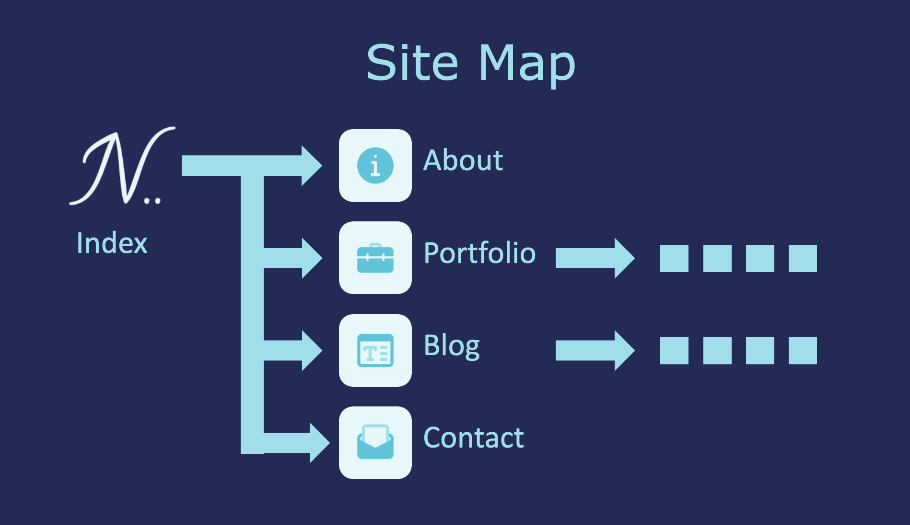

# T1A2---Portfolio

### URL to my published portfolio website:
https://profolion.azurewebsites.net

### Link to my GitHub repo:
https://github.com/noe13hsu/T1A2---Portfolio

### Description of my portfolio website:
* Purpose: The goal of this portfolio website is for potential employers and partners to know what skills I have and what projects I have done and for them to contact or connect with me.

* Functionality:
  1. Links to Facebook and LinkedIn for potential employers and partners to contact and connect with me.
  1. Link to GitHub and CodePen to view the projects I have done.
  1. Contact form for potential employers and partners to email me.
  1. My skills, interests and study/work history presented in an easily readable style in about.html.
  1. Link in about.html to download a copy of my cv.
  1. short videos in portfolio.html to view the projects I have done.
  1. Purpose of blog.html is to show some of my interests and daily life.

* Site map:
  
    
  
* Screenshots:
  
    

    

    

    

    

    

    

    

    

    

* Target audience: Any potential employers and partners.

* Tech stack: HTML, CSS, Animate.css. 
